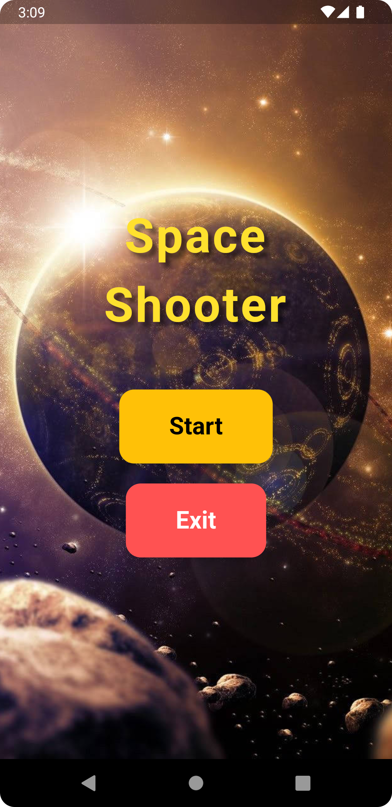

# Flutter Flame Space Shooter Game

Welcome to the **Flutter Flame Space Shooter Game**! This is an exciting space shooter game developed using the Flutter framework and the Flame game engine. The game features a main menu, beautiful background images, and interactive gameplay elements such as player movement, shooting, and enemy spawning.

## Table of Contents

- [Introduction](#introduction)
- [Features](#features)
- [Screenshots](#screenshots)
- [Installation](#installation)
- [Usage](#usage)
- [Gameplay](#gameplay)
- [Dependencies](#dependencies)
- [License](#license)
- [Contributing](#contributing)
- [Contact](#contact)

## Introduction

The **Flutter Flame Space Shooter Game** is a demonstration of how to create a simple yet engaging game using Flutter and the Flame game engine. The game showcases various aspects of game development, including handling user input, managing game objects, and creating interactive animations.

## Features

- **Main Menu**: A beautiful main menu with a background image and options to start or exit the game.
- **Player Movement**: Drag to move the player ship around the screen.
- **Shooting Mechanism**: Automatic shooting when the player moves.
- **Enemy Spawning**: Enemies spawn periodically and move down the screen.
- **Parallax Background**: A visually appealing parallax background for a dynamic space environment.

## Screenshots

<p align="center">
  
  
</p>

## Installation

To get started with the Flutter Flame Space Shooter Game, follow these steps:

1. **Clone the Repository**:
    ```bash
    git clone https://github.com/Hamza-Maa/Space_Shooter_Game.git
    cd Space_Shooter_Game
    ```

2. **Install Dependencies**:
    Ensure you have Flutter installed. Then, run the following command to install dependencies:
    ```bash
    flutter pub get
    ```

3. **Run the App**:
    Launch the app using your preferred IDE or the command line:
    ```bash
    flutter run
    ```

## Usage

### Main Menu

- **Start Game**: Click the "Start" button to begin playing.
- **Exit Game**: Click the "Exit" button to close the game.

### Gameplay

- **Move Player**: Drag on the screen to move the player ship.
- **Shooting**: The player ship automatically shoots when moving.
- **Avoid Enemies**: Dodge incoming enemies to survive.

## Gameplay

In the **Flutter Flame Space Shooter Game**, you control a spaceship that can move around the screen. Your goal is to avoid enemies and survive as long as possible. Enemies spawn at the top of the screen and move downward, and your spaceship automatically shoots when you move.

## Dependencies

This project uses the following dependencies:

- **Flutter SDK**: `>=3.4.3 <4.0.0`
- **Flame**: `^1.18.0`

Ensure your `pubspec.yaml` includes these dependencies:

```yaml
dependencies:
  flutter:
    sdk: flutter
  flame: ^1.18.0
```

## License

This project is licensed under the MIT License. See the [LICENSE](LICENSE) file for more information.

## Contributing

Contributions are welcome! If you have any suggestions, improvements, or bug fixes, feel free to create a pull request or open an issue.

## Contact

For any questions or inquiries, please contact:

- Email: hamza.maatougui@outlook.com
- GitHub: [Hamza-Maa](https://github.com/Hamza-Maa)
